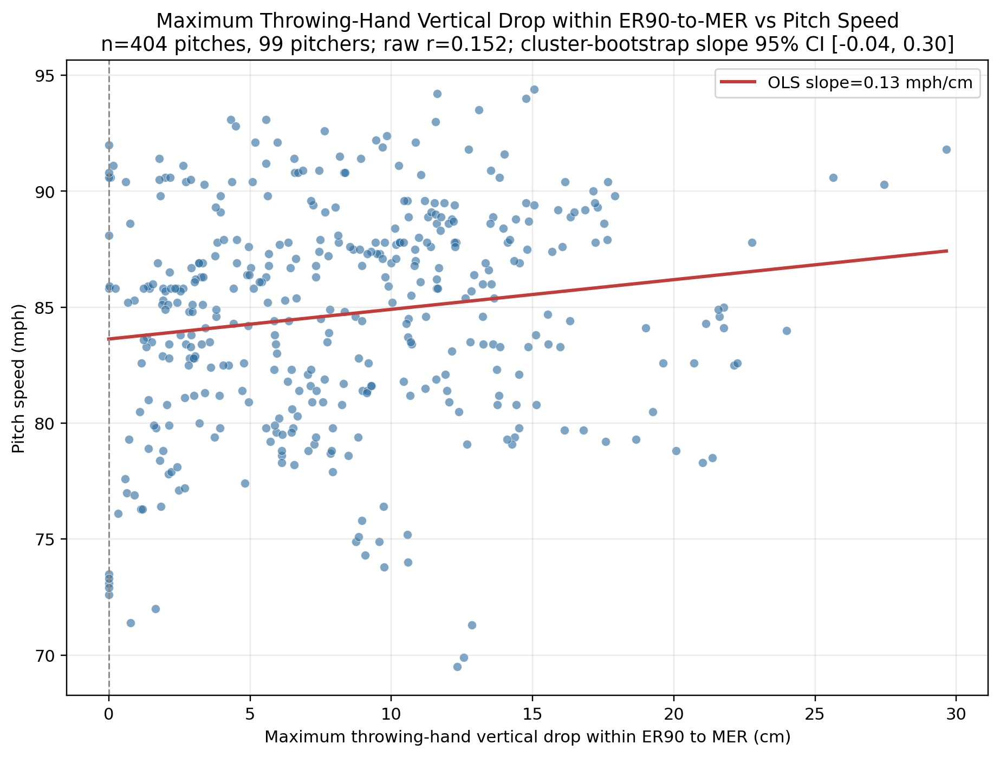

# ER90 到 MER 手部最大下降與球速分析證據

## 摘要

本分析使用投球手 `hand_jc_z`，計算 ER90→MER 內的最大垂直 drawdown，而不是 ER90 與 MER 的端點差。跨投手的群集推論不顯著；投手內中心化結果則顯示小幅正向關係。

## 定義與資料路徑

| 項目 | 定義／來源 |
|---|---|
| 手部高度 | `landmarks.csv:hand_jc_z`；全域 +z 向上，不使用 `glove_hand_jc_z` |
| 最大下降 | `max_{ER90≤s≤t≤MER}[hand_z(s) - hand_z(t)]`，單位 cm |
| 球速 | `metadata.csv:pitch_speed_mph`；與 `poi_metrics.csv:pitch_speed_mph` 逐球完全一致 |
| ER90 | `shoulder_angle_z = 90°` 的唯一上升穿越，搜尋窗為 `fp_poi_time` 至 `MER_time` |
| MER | full-signal `MER_time`；MER 的 `shoulder_angle_z` 與 POI `max_shoulder_external_rotation` 驗證 |

所有 411 個 pitch key 都能對上。7 球沒有唯一的 ER90 上升穿越而排除，未用其他事件補代，因此正式分析為 404 球、99 位投手。

## 最大下降分布

| 指標 | 數值 |
|---|---:|
| 平均 | 8.328 cm |
| 標準差 | 5.632 cm |
| 中位數 | 7.755 cm |
| Q1–Q3 | 3.377–11.923 cm |
| 範圍 | 0.000–29.648 cm |
| 平均佔投手身高 | 4.500% |

## 與球速的關係

| 分析層級 | 估計 |
|---|---:|
| 逐球 Pearson r | 0.152，p = 0.0022，R² = 0.023 |
| 逐球 Spearman rho | 0.164，p = 0.00094 |
| 投手群集 OLS 斜率 | +0.128 mph/cm，p = 0.133 |
| 群集 OLS 斜率 95% CI | −0.039–+0.295 mph/cm |
| 投手群集 bootstrap 斜率 95% CI | −0.036–+0.299 mph/cm |
| 投手群集 bootstrap r 95% CI | −0.042–+0.342 |
| 投手內中心化 Pearson r | 0.206，R² = 0.042 |
| 投手內中心化群集斜率 | +0.117 mph/cm，p = 0.0012 |
| 投手內中心化斜率 95% CI | +0.046–+0.188 mph/cm |
| 投手平均層級 Pearson r | 0.154，p = 0.127 |

群集 bootstrap 以投手為重抽樣單位，5,000 次、固定 seed `20260906`。逐球 p 值只作描述，因同一投手有重複投球。主要限制是觀察性資料仍可能受其他同時改變的手臂路徑、軀幹姿勢與速度變項混雜。

## 可重現輸出

- 分析腳本：[analyze_er90_mer_hand_height_speed.py](../code/py/analyze_er90_mer_hand_height_speed.py)
- 逐球指標：[er90_mer_hand_height_speed_metrics.csv](../code/py/er90_mer_hand_height_speed_outputs/er90_mer_hand_height_speed_metrics.csv)
- 排除清單：[er90_mer_exclusions.csv](../code/py/er90_mer_hand_height_speed_outputs/er90_mer_exclusions.csv)
- 摘要 JSON：[er90_mer_hand_height_speed_summary.json](../code/py/er90_mer_hand_height_speed_outputs/er90_mer_hand_height_speed_summary.json)

