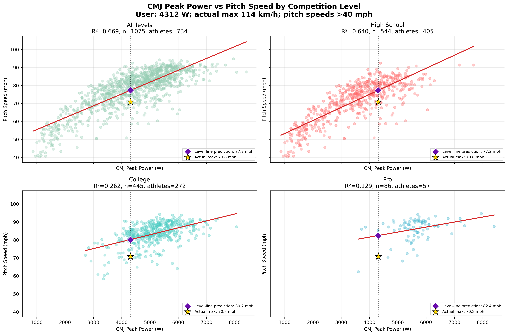

# HP 球速預測模型驗證

## 摘要

**初步支持**：HP 測試可以估計群體層級的球速範圍，但對單一新投手仍有明顯不確定性。最佳候選模型使用全部 HP 數值欄位加 playing level；以選手為單位的 5-fold out-of-sample 驗證中，MAE 為 4.00 mph（6.43 km/h）、RMSE 為 5.27 mph（8.48 km/h）、中位絕對誤差為 3.16 mph（5.08 km/h），90% 絕對誤差不超過 8.10 mph（13.04 km/h）。

只提供 CMJ 與體重仍可預測，但誤差略大：MAE 4.14 mph（6.66 km/h）、RMSE 5.44 mph（8.75 km/h），90% 絕對誤差不超過 8.53 mph（13.73 km/h）。加入 IMTP 後沒有明顯降低誤差。

若輸入來自一般 VALD PDF、只使用可從報告精確對應的 15 個欄位，HP-only 模型的整體 MAE 為 4.18 mph；在 15 欄皆完整的 400 筆驗證資料中，MAE 為 3.63 mph，90% 絕對誤差為 7.06 mph。這個欄位組合可用於個人 PDF 報告，而不必猜測未出現在報告上的指標。

若每項測試只保留一個最低分組驗證 MAE 的指標，再加體重，六欄模型選到 CMJ Peak Power、SJ Peak Power、IMTP Peak Vertical Force、Hop Test Best RSI、PPU Eccentric Peak Force 與體重。Nested grouped CV 的整體 MAE 為 4.22 mph；15 個候選欄位皆完整的 400 筆中，MAE 為 3.66 mph、90% 絕對誤差為 7.23 mph。PPU Eccentric 與 Takeoff Force 的單變量 MAE 只差 0.0015 mph，且外層 folds 會互換，因此不支持其中一項具有穩定優勢。

拿掉 IMTP Peak Vertical Force、其餘欄位不變時，五欄模型的整體 MAE 從 4.22 小幅增加至 4.27 mph，90% 絕對誤差從 8.13 增至 8.42 mph；完整 profile 的 MAE 從 3.66 增至 3.72 mph。IMTP 只提供很小的增量預測資訊，不是六欄模型主要誤差來源。

只保留 CMJ Peak Power 與 SJ Peak Power 時，雙欄模型的整體 MAE 為 4.52 mph、90% 絕對誤差為 8.97 mph、R² 為 0.71。相較五／六欄模型，誤差略增但整體 R² 只小幅下降，表示這兩個絕對 Peak Power 欄位承載了精簡模型的大部分群體層級預測訊號；這不代表它們足以解釋個人的體能至球速轉換效率。

將兩項 Peak Power 完全分開做單變量模型時，CMJ Peak Power-only 的 MAE 為 4.83 mph、R² 為 0.67；SJ Peak Power-only 的 MAE 為 5.05 mph、R² 為 0.62。以未見選手的整體誤差判斷，CMJ absolute Peak Power 的單變量預測力略優於 SJ absolute Peak Power，但兩者都不如合併使用。

個案的 VALD CMJ Peak Power 平均為 4312 W（4 次範圍 4162–4396 W），實際最快球速為 114 km/h。排除 `pitch_speed_mph <= 40` 的無效／非代表性球速後，4312 W 在線性分層散布圖上的預測為：綜合 124.3、高中 124.3、大學 129.0、職業 132.6 km/h。綜合／高中線確實比 CMJ-only Extra Trees 的 129.2 km/h 低，但四條線仍全數高估實際球速；此個案支持「CMJ 絕對功率充足，但體能至球速轉換低於資料集平均」的描述，不能單靠競技層級校正解決。職業組內線的樣本僅 86 列、57 位選手，且圖上 `R² = 0.129`，不應把 132.6 km/h 當成精準個人潛力。

在相同 1075 列、734 位選手及相同 5-fold `GroupKFold` 下公平比較，CMJ-only Extra Trees 的 MAE 為 4.82 mph、RMSE 6.21 mph、R² 0.673；單純線性迴歸的 MAE 為 4.93 mph、RMSE 6.27 mph、R² 0.667。Extra Trees 整體略優，但 MAE 只改善 0.11 mph（0.18 km/h），實務差異很小。線性模型對此個案較接近實際值，不代表其在未見選手上的整體預測效果較好。

## 驗證設計

- 資料：`high_performance/data/hp_obp.csv`
- 主要敏感度樣本：`pitch_speed_mph > 40`，1,086 列、734 位選手
- 模型：Extra Trees；缺值只由各訓練 fold 的中位數補值
- 切分：5-fold `GroupKFold`，以 `athlete_uid` 分組；同一選手不會同時進入訓練與驗證資料
- HP-only 候選欄位：42 個數值欄位；日期、ID、球速分組、投球 HSS、打擊測量均未作為 predictor
- playing level 僅在標示為 `plus_playing_level` 的模型中使用
- HP 測試與球速測量相隔 -14 至 +14 天，中位數 0 天；5th–95th percentile 為 -5 至 +9 天
- 另以所有正球速（包含 8 筆低於 40 mph）重跑；完整 HP + level 模型的 MAE 4.05 mph、RMSE 5.31 mph，結論相近

## 模型比較（球速 > 40 mph）

| 可提供資料 | MAE (mph) | RMSE (mph) | 中位絕對誤差 (mph) | 90% 絕對誤差 (mph) | R² |
|---|---:|---:|---:|---:|---:|
| 每項測試 1 欄 + 體重，共 6 欄（不含 level） | 4.22 | 5.55 | 3.44 | 8.13 | 0.74 |
| 上述模型拿掉 IMTP，共 5 欄（不含 level） | 4.27 | 5.60 | 3.49 | 8.42 | 0.73 |
| CMJ PP + SJ PP，共 2 欄（不含 level） | 4.52 | 5.88 | 3.84 | 8.97 | 0.71 |
| 只用 CMJ PP，1 欄（不含 level） | 4.83 | 6.22 | 4.10 | 9.76 | 0.67 |
| 只用 SJ PP，1 欄（不含 level） | 5.05 | 6.67 | 4.17 | 9.87 | 0.62 |
| VALD PDF 可精確對應 15 欄（不含 level） | 4.18 | 5.50 | 3.43 | 8.32 | 0.74 |
| CMJ + 體重 + level | 4.14 | 5.44 | 3.30 | 8.53 | 0.75 |
| CMJ + IMTP + 體重 + level | 4.14 | 5.48 | 3.34 | 8.47 | 0.74 |
| 全部 HP + level | 4.00 | 5.27 | 3.16 | 8.10 | 0.76 |

## 解讀限制

整體 R² 主要反映資料涵蓋高中、大學與職業層級的廣泛球速差異，不能直接當成成熟投手之間的辨識能力。完整 HP + level 模型在大學子群的 out-of-sample R² 為 0.32，在職業子群僅 0.11；職業樣本也只有 88 列。因此，個人預測應報告點估計與誤差範圍，不應把小數點後的球速當成精準答案。

新個案若來自不同量測設備、測試 protocol、年齡或族群，這些誤差可能低估真實外部誤差。預測前也必須檢查各輸入值是否落在訓練資料範圍內；缺少整組測驗時，應改用已單獨驗證的相應欄位組合，不能把全欄位模型的誤差直接套用。

肩內旋力量的固定樣本增量驗證不支持其改善六欄模型；最佳 ΔMAE 只有 -0.028 mph，且選手層級 bootstrap CI 跨過 0。詳見 [[肩內旋力量與球速預測增量]]。

## 重現資料

- 腳本：`baseball_pitching/code/py/predict_pitch_speed_from_hp.py`
- 完整指標：`baseball_pitching/data/hp_pitch_speed_prediction/report.json`
- 每筆 out-of-fold 預測：`baseball_pitching/data/hp_pitch_speed_prediction/oof_predictions_speed_over_40_sensitivity.csv`
- CMJ 分層個案圖：`baseball_pitching/code/py/plot_cmj_level_user_prediction.py`
- CMJ 分層個案數值：`baseball_pitching/data/hp_pitch_speed_prediction/cmj_level_user_prediction.csv`
- 分析日期：2026-08-24
