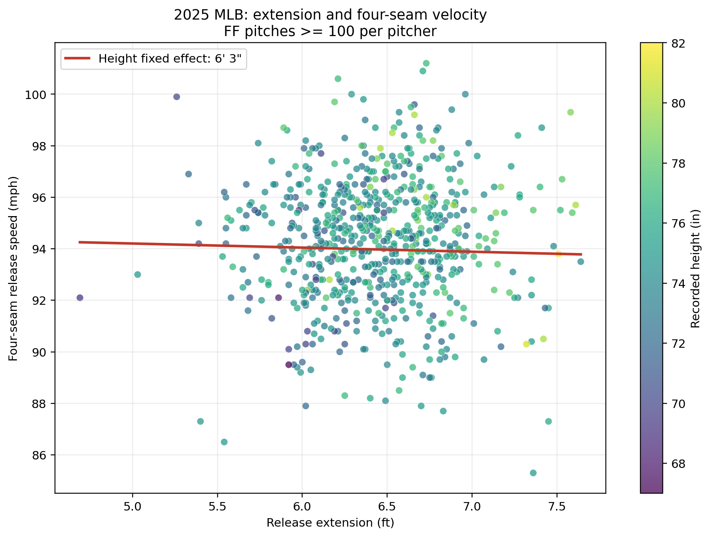

# MLB 身高固定下 extension 與四縫線球速

2025 MLB 例行賽的四縫線資料中，沒有看到「在相同身高下，release extension 越高，投手的 release speed 越快」的證據。以投手-球季為單位、納入至少 100 顆 FF 的 678 位投手分析，並以 MLB 官方記錄身高的英吋固定效果控制身高，extension 每增加 1 ft 的球速估計為 **−0.16 mph**（95% CI −0.69 到 0.37，p = 0.554）。extension 第 25 到第 75 百分位相差 0.555 ft 時，模型預測球速差約 **−0.09 mph**，實質上接近零。

因此，本次結果的機制狀態是：**不支持**。這是 release speed 的關聯分析，不代表 extension 對 perceived velocity、打者反應時間或投球效果沒有影響，也不能解讀成 extension 會使球速變慢。

證據與重現：

- 分析腳本：`baseball_pitching/code/py/analyze_mlb_extension_height_velocity.py`
- 合併資料：`baseball_pitching/data/mlb_2025_ff_extension_height_velocity_merged.csv`
- 模型結果：`baseball_pitching/data/mlb_2025_extension_height_velocity_results.csv`
- Baseball Savant 將原始速度定義為 `release_speed`（mph），原始 extension 定義為 `release_extension`（ft）；本次投手彙總下載中速度欄位呈現為 `velocity`。查詢限定 2025 例行賽、FF、每位投手至少 100 球（[Statcast CSV 欄位說明](https://baseballsavant.mlb.com/csv-docs)）。
- 身高由 [MLB Stats API 的 2025 球員資料](https://statsapi.mlb.com/api/v1/sports/1/players?season=2025) 以 MLBAM `player_id` 合併；身高是球員資料中以英呎/英吋記錄的離散值，因此「相同身高」是相同的官方記錄英吋，不是精密人體測量值。

主要限制是投手-球季彙總資料仍可能受角色、年齡、球種選擇與投手個人能力混淆；本結果是 2025 單季的同身高關聯，不能直接推論因果或跨球季穩定性。
