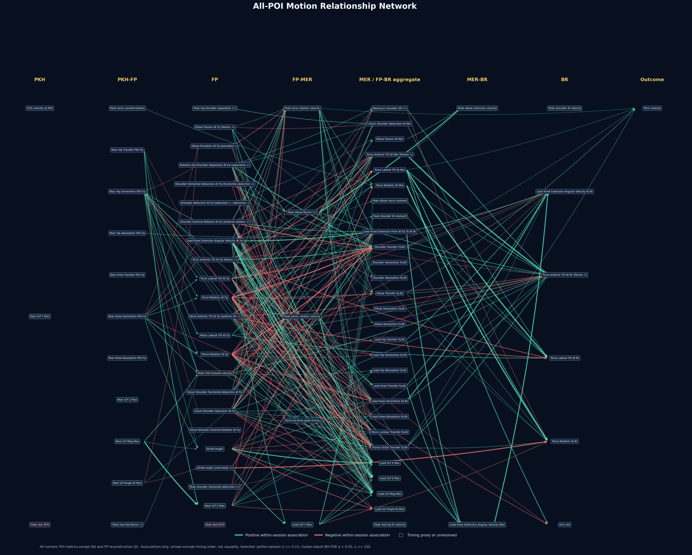

# POI 動作關聯網分析

## 摘要

全 POI 關聯網收錄目前 `poi_metrics.csv` 的全部 79 個可分析數值欄。明示 FP、MER、BR 或計算區間的欄位直接按定義排序；沒有事件標記的峰值則回到 full-signal 重建每球峰值時間，再按全體投球的中位時間放到最近階段。這張圖目前只能解讀為「動作共同變化」，不能解讀為前一動作造成後一動作。

## 第一版結果

- 資料：`data/poi/poi_metrics.csv`，411 球、100 個 session，每個 session 2–5 球。
- 節點：79 個數值 POI 指標；排除四個識別／分類欄及三個 FP 重建品質欄。
- 時間軸：PKH、PKH–FP、FP、FP–MER、MER／FP–BR aggregate、MER–BR、BR、Outcome。
- 比較：2,366 組由較早階段指向較晚階段的配對。
- 主圖門檻：`|within-session r| >= 0.15`、session-cluster robust 檢定經 Benjamini–Hochberg FDR 後 `q < 0.05`，且 `n >= 250`。
- 通過門檻：285 條邊。箭頭只表示明示或重建後的投球時序，不是資料推定的因果方向。

節點分布：

| 時期 | 節點數 |
|---|---:|
| PKH | 3 |
| PKH–FP | 11 |
| FP | 23 |
| FP–MER | 5 |
| MER／FP–BR aggregate | 28 |
| MER–BR | 2 |
| BR | 6 |
| Outcome | 1 |

最強的個人內關聯包括：

| 較早指標 | 較晚指標 | within-session r | FDR q |
|---|---|---:|---:|
| MER 軀幹旋轉 | BR 軀幹旋轉 | 0.763 | <0.001 |
| MER 軀幹前傾 | BR 軀幹前傾 | 0.756 | <0.001 |
| FP 肩髖分離 | 最大肩髖分離 | 0.604 | <0.001 |
| 跨步角度 | BR 軀幹旋轉 | -0.503 | <0.001 |
| FP 前膝伸展角速度 | FP–BR 前膝伸展量 | 0.481 | <0.001 |
| 最大骨盆旋轉速度 | FP–BR 前膝伸展量 | 0.386 | <0.001 |

球速是唯一 Outcome 節點。與球速相連的邊仍需逐條區分原始球級、cluster-robust 與 within-session 結果；不能因為全量網路出現更多連線，就把其中任何一條稱為已確立的球速因果機制。

## 時期分類方法

- 52 個欄位由欄名或定義明示事件／區間。
- 22 個峰值欄位由 full-signal 的實際極值時間分類，並將重建值與 POI 值比對。
- 2 個 GRF angle 欄位沿用相對應 GRF magnitude peak 的時間。
- `max_cog_velo_x` 由 `centerofmass_x` 對時間微分後的峰值時間分類。
- `peak_rfd_rear` 與 `peak_rfd_lead` 的原始 POI 生成算法無法從目前倉庫追溯；暫以 GRF magnitude 最大正向變化率的時間作低信心代理，圖中以紅色節點邊框標示。
- 完整欄位分類、代表 phase coordinate、重建相關與誤差見 `poi_motion_network_peak_timing.csv`。

## 重要限制

1. POI 是觀察資料；沒有介入、工具變數或充分的因果調整集合，不能由這張網路估計「改變 A 會使 B 改變多少」。
2. 每個 session 只有 2–5 球，within-session 效果量可估，但個別投手的斜率無法穩定估計；顯著性使用 session-cluster robust 標準誤。
3. 明示事件欄位按定義排序；峰值欄位使用全體投球的中位峰值時間，因此個別球仍可能落在相鄰時期。
4. 有些配對的原始相關與 within-session 關聯方向不同，表示投手間差異可能掩蓋或反轉個人內關係。這些邊在取得更好的混雜控制前不應寫成教練指令。
5. 第一版未納入完整時間序列、體型、球種及投球側等調整，也沒有建立結構因果模型。

## 可重現檔案

- 分析腳本：`code/py/analyze_poi_motion_network.py`
- 全部配對：`code/py/poi_motion_network_outputs/poi_motion_network_all_edges.csv`
- 主圖邊：`code/py/poi_motion_network_outputs/poi_motion_network_selected_edges.csv`
- 峰值時期驗證：`code/py/poi_motion_network_outputs/poi_motion_network_peak_timing.csv`
- 節點與摘要：同一輸出資料夾內的 nodes CSV 與 summary JSON。

## 狀態

**初步支持（關聯網）**。目前結果適合作為後續機制假說與精細模型的索引，不足以寫成「不同投球動作彼此造成影響」的定論。
