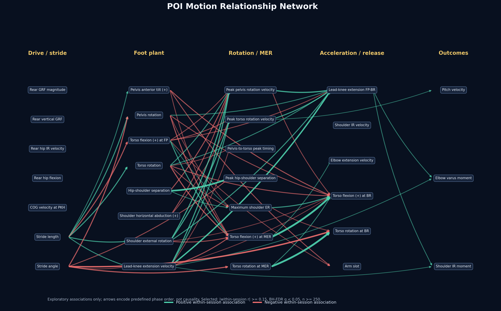

# POI 動作關聯網分析

## 摘要

第一版 POI 關聯網顯示，同一投手在不同球之間的動作變化確實形成可視化的連動結構；最穩定的關係主要是同一運動學量由較早事件延續至較晚事件，例如 MER 軀幹旋轉角度與 BR 軀幹旋轉角度，以及 MER 與 BR 的軀幹前傾。這張圖目前只能解讀為「動作共同變化」，不能解讀為前一動作造成後一動作。

## 第一版結果

- 資料：`data/poi/poi_metrics.csv`，411 球、100 個 session，每個 session 2–5 球。
- 節點：31 個核心 POI 指標，依推進／跨步、FP、旋轉／MER、加速／BR、結果五個階段排列。
- 比較：377 組由較早階段指向較晚階段的配對。
- 主圖門檻：`|within-session r| >= 0.15`、session-cluster robust 檢定經 Benjamini–Hochberg FDR 後 `q < 0.05`，且 `n >= 250`。
- 通過門檻：60 條邊。箭頭只表示預先指定的投球時序，不是資料推定的因果方向。

最強的個人內關聯包括：

| 較早指標 | 較晚指標 | within-session r | FDR q |
|---|---|---:|---:|
| MER 軀幹旋轉 | BR 軀幹旋轉 | 0.763 | <0.001 |
| MER 軀幹前傾 | BR 軀幹前傾 | 0.756 | <0.001 |
| FP 肩髖分離 | 最大肩髖分離 | 0.604 | <0.001 |
| 跨步角度 | BR 軀幹旋轉 | -0.503 | <0.001 |
| FP 前膝伸展角速度 | FP–BR 前膝伸展量 | 0.481 | <0.001 |
| 最大骨盆旋轉速度 | FP–BR 前膝伸展量 | 0.386 | <0.001 |

在這組節點與門檻下，直接連到球速的邊只有「最大軀幹旋轉速度 → 球速」：原始球級 `r = 0.328`，within-session `r = 0.151`，within-session cluster-robust FDR `q = 0.041`。因此它可視為弱的個人內連動，不能稱為已確立的球速因果機制。

## 重要限制

1. POI 是觀察資料；沒有介入、工具變數或充分的因果調整集合，不能由這張網路估計「改變 A 會使 B 改變多少」。
2. 每個 session 只有 2–5 球，within-session 效果量可估，但個別投手的斜率無法穩定估計；顯著性使用 session-cluster robust 標準誤。
3. 節點選擇與階段順序是事前人工定義。最大值可能出現在不同時間，不能僅靠欄位所在階段保證瞬時力學先後。
4. 有些配對的原始相關與 within-session 關聯方向不同，表示投手間差異可能掩蓋或反轉個人內關係。這些邊在取得更好的混雜控制前不應寫成教練指令。
5. 第一版未納入完整時間序列、體型、球種及投球側等調整，也沒有建立結構因果模型。

## 可重現檔案

- 分析腳本：`code/py/analyze_poi_motion_network.py`
- 全部配對：`code/py/poi_motion_network_outputs/poi_motion_network_all_edges.csv`
- 主圖邊：`code/py/poi_motion_network_outputs/poi_motion_network_selected_edges.csv`
- 節點與摘要：同一輸出資料夾內的 nodes CSV 與 summary JSON。

## 狀態

**初步支持（關聯網）**。目前結果適合作為後續機制假說與精細模型的索引，不足以寫成「不同投球動作彼此造成影響」的定論。
