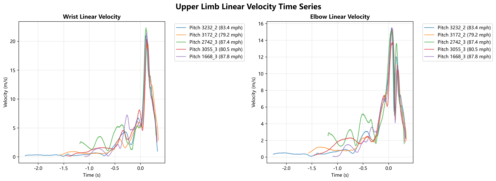

# 投球手 (Pitching Arm)

上肢的動作是能量傳遞的最末端，直接決定最終球速。

## 線性速度
- **手腕線性速度 (max_wrist_velocity, m/s)**: 與球速高度相關 (r = 0.809, n = 411)，是目前分析中最強的線性速度指標。
- **手部/手肘速度**: `max_hand_velocity` (r = 0.757), `max_elbow_velocity` (r = 0.703)。
- **體重的額外解釋力**: 在樣本內僅有很小增量；投手分組的 out-of-sample 驗證不支持體重提供穩定的額外球速解釋力。詳見 [[手腕速度與體重球速解釋力分析]]。
- **放球時手部動作假說**: 同一投手內，去除投手平均後的手腕速度仍與球速呈弱至中度正相關；這支持進一步檢驗放球時的手部速度方向、時序與位置，但目前尚未證明因果關係。

## 能量轉移 (Energy Transfer)
- **關鍵變數**:
    - `Elbow Transfer FP-BR`: r = 0.691
    - `Shoulder Transfer FP-BR`: r = 0.651
    - `Thorax Distal Transfer FP-BR`: r = 0.645
- **最新研究結論 (Shoulder Energy)**:
    - **規模主導**: 體重是肩膀絕對能量轉移(J)最強預測指標(R²=0.481)，技術指標需標準化(J/kg)才有意義。
    - **整段總轉移的組成**: [[肩部STP分解驗證]] 顯示100位投手的官方FP–BR總轉移中，體重單獨R²=0.469；加入重建平均總功率與FP–BR時間後，重複10-fold CV R²=0.899。平均功率是主要組成，時間仍提供重要的額外訊號；這是積分組成，不是因果預測因子。
    - **線性 vs 旋轉**: 肩部線性速度對絕對能量的預測力(R²=0.436)遠高於旋轉速度(R²=0.011)。
    - **Shoulder transfer 與軀幹旋轉**: [[能量轉移與軀幹旋轉]] 初步支持兩者捕捉不同機制，而非同一路徑的替代指標。
    - **限制期 STP 的組成**: [[肩部STP分解驗證]] 顯示軀幹側限制期的累積 STP 差異以有效持續時間為主要成分，平均功率仍有較小但明顯的額外訊號；此範圍不能外推成整段肩部總轉移。
    - **速度來源（需重算）**: ~~肩部線性速度 86.7% 來自軀幹中心平移速度，旋轉速度貢獻不到 1%。~~
    - **軀幹角速度解釋肩部線速度**: [[能量轉移與軀幹旋轉]] 不支持「肩部線速度主要來自軀幹 z/x 角速度」。
    - ~~**技術核心（需重估）**: [[能量轉移與軀幹旋轉]] 未能複現「軀幹角加速度與減速量主導 shoulder transfer J/kg、且強於峰值轉速」的舊說法。~~
    - **時序**: 能量轉移峰值發生在 FP-BR 區間的 51.81% 處，與軀幹旋轉速度峰值時間點一致。

## 角度與預測
- **肩部旋轉速度**: 峰值與球速中等相關 (r = 0.313)。
- **肩水平外展**: 最大值與球速強相關 (r = 0.339)，最佳範圍 53.8°。
- **最大肩外旋 (MER)**: 預測因子包含軀幹前傾 MER、球速、最大肩水平外展等。

