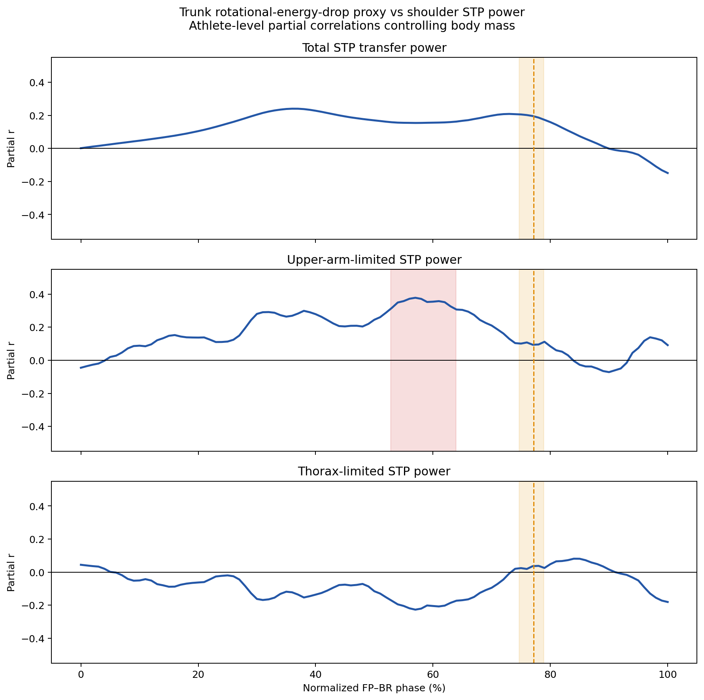

# 肩部 STP 分解驗證

## 結論

肩部 STP 的兩側限制端接近平均，但上臂側略常成為較小端。於 `fp_poi_time` 至 BR 的有效 STP transfer 時間點，上臂側較小占53.1%，軀幹側占46.9%；這不支持先前「上臂側占72.4%」的強瓶頸結論。

## 正確公式

`thorax_dist_seg_pwr` 與 `upper_arm_prox_seg_pwr` 是總 segment power（SP），不是純 segment torque power（STP）：

```text
SP = JFP + STP
```

`shoulder_energy_transfer_jfp` 以流入上臂為正，因此：

```text
thorax_stp   = thorax_dist_seg_pwr + shoulder_energy_transfer_jfp
upper_arm_stp = upper_arm_prox_seg_pwr - shoulder_energy_transfer_jfp
```

### 軀幹側STP的三軸分量

直接以 `-shoulder_thorax_moment_axis * radians(torso_velo_axis)` 重建軀幹側肩部STP。三軸加總與上述 `thorax_stp` 高度對齊（r = 0.99486，MAE = 12.22 W），確認反作用力矩的負號與功率分解方向。

在 FP 至 BR：

- 以每個時間點絕對功率最大的軸判定：z軸88.96%、x軸10.55%、y軸0.49%
- 以三軸絕對功率總和加權：z軸83.54%、x軸13.49%、y軸2.98%

因此z軸不只是角速度最大，也是軀幹側肩部STP的主導功率分量。不能再把「減速代理只看z軸、漏掉其他軸」列為低相關的主要解釋；主要落差應放在軀幹淨動能變化仍同時受到近端輸入，以及實際transfer常由上臂側較小端限制。

當兩側 STP 異號時：

```text
transfer magnitude = min(abs(thorax_stp), abs(upper_arm_stp))
```

軀幹側為負、上臂側為正時，transfer 記為正；方向相反時記為負；同號時 torque transfer 為零。

此公式與 full-signal `shoulder_energy_transfer_stp` 的逐幀結果完全對齊：

- 全部有效列：411球
- r = 1.000000000000
- 平均絕對誤差：0.000017 W
- 最大絕對誤差：0.0008 W
- `thorax_stp + upper_arm_stp = shoulder_energy_generated`，平均絕對誤差0.000028 W

## FP 至 BR 結果

- 事件窗：`fp_poi_time` 至 `BR_time`
- 全部時間點：21,205
- 兩側 STP 異號、存在 torque transfer：20,166（95.1%）
- frame-weighted：上臂側較小53.1%，軀幹側較小46.9%
- 各球比例取平均：上臂側53.2%，軀幹側46.8%
- 411球中：226球以上臂側較小時間點居多，174球以軀幹側居多，11球相同
- 依 transfer magnitude 加權：上臂側較小54.6%，軀幹側較小45.4%
- transfer方向：99.3%的有效時間點為軀幹流向上臂

### 瓶頸當下的功率大小

瓶頸時間比例與功率大小分開計算：

| 當下限制端 | 時間點占比 | 條件平均 transfer power | 條件中位 transfer power | 累積功率樣本占比 |
|---|---:|---:|---:|---:|
| 軀幹側 | 46.9% | 1147 W | 1103 W | 45.4% |
| 上臂側 | 53.1% | 1223 W | 1218 W | 54.6% |

上臂限制時的條件平均功率比軀幹限制時高6.6%。以每位投手先平均後配對，上臂限制時為1269 W、軀幹限制時為1104 W（paired p < 0.001）。因此時間占比沒有掩蓋「軀幹限制時功率特別大」；資料反而顯示上臂限制端在時間和功率強度上都略占較多。

將同一位投手的軀幹旋轉動能下降代理 `omega_peak^2 - omega_BR^2` 與兩部分拆開比較，控制體重後：

| STP部分 | partial r | p |
|---|---:|---:|
| 軀幹限制時的條件平均功率 | -0.080 | 0.431 |
| 上臂限制時的條件平均功率 | 0.248 | 0.013 |
| 軀幹限制時間點的累積功率樣本 | -0.195 | 0.052 |
| 上臂限制時間點的累積功率樣本 | 0.475 | <0.001 |
| 兩部分合計 | 0.232 | 0.020 |
| 上臂側較小的時間比例 | 0.269 | 0.007 |

這表示減速代理的正向訊號主要出現在「上臂側較小、由上臂端決定實際transfer」的時間，而不是軀幹側成為較小端的時間；減速越大者也更常以上臂側為較小端。兩部分加總時方向相反，會削弱總STP與減速代理的整體相關。`累積功率樣本`是 transfer power 乘上近乎固定取樣間隔前的等比例量；資料時間因四位小數儲存而在0.0027與0.0028秒間交替，因此此處用於分解占比與相關，不冒充精確事件積分焦耳。

上述百分比的分母不同，不能相乘或直接推導解釋率：z軸83.5%是「軀幹側肩部STP內部」的軸向組成；軀幹限制部分45.4%是「實際transfer累積功率樣本」的組成；約5%則是100位投手之間，控制體重後 `delta_omega_sq` 與總STP的共享變異。高組成占比不保證投手間共變異高。

控制體重後進一步將 `delta_omega_sq` 與總累積功率樣本的共變異拆開：上臂限制部分提供總正向共變異的204.9%，軀幹限制部分貢獻-104.9%，兩者相加才是100%。超過100%不是能量占比，而是因一部分正向、一部分負向；它直接顯示軀幹限制部分抵銷了約一半的上臂限制正向訊號。

### 限制端的時間順序

限制端不是完全雜亂，而有明顯的群體相位結構。FP至BR前60%主要為上臂側較小，之後逐漸轉向軀幹側較小；70–80%時軀幹側占61.8%，80–90%占87.8%，90–100%占93.5%。BR最後一個有效時間點有92.7%的球為軀幹側較小。

逐球原始訊號仍常有早期交錯：切換次數中位數2次（IQR 2–3），76.2%的球至少切換兩次。最常見序列為 `軀幹→上臂→軀幹`（31.4%）、`上臂→軀幹→上臂→軀幹`（27.7%）及`上臂→軀幹`（21.7%）。所以較準確的描述是「早中期可交錯，但末段高度一致地收斂到軀幹側限制」，不是單一固定切換，也不是隨機散布。

功率累積確認時間占比會高估末段軀幹限制的重要性。FP至BR前30%只累積22.9%的transfer power；50–80%單獨貢獻44.6%；至MER已累積88.5%，MER後只剩11.5%。MER前的累積功率中60.3%由上臂側限制，MER後則88.9%由軀幹側限制。換成全部transfer power的四分法，最大單一區塊是「MER前＋上臂限制」53.4%，其次為「MER前＋軀幹限制」35.2%，「MER後＋軀幹限制」10.2%，「MER後＋上臂限制」1.3%。因此能量大宗確實落在MER前的上臂限制區間；末段雖幾乎都由軀幹限制，但剩餘可轉移功率已少。

### 減速代理與STP功率的SPM時序

以100位投手為獨立分析單位，每球FP至BR正規化101點後先在投手內平均。預測量為投手平均 `omega_peak^2 - omega_BR^2`，結果曲線為正向STP transfer power，SPM GLM同時控制體重。總STP沒有顯著cluster；拆開限制端後，只有上臂限制功率在FP–BR 52.74–63.87%出現顯著正相關cluster（cluster p = 0.000047，區間平均partial r = 0.354，峰值partial r = 0.378，位於57%）。即使對總STP、上臂限制、軀幹限制三個SPM檢定作Bonferroni校正，該cluster仍成立（adjusted p約0.00014）。軀幹限制功率沒有顯著cluster。

此結果將「能量增加」操作化為瞬時正向STP功率，而不是已累積能量。顯著區間早於MER中位77.18%（IQR 74.66–78.83%），也正位於上臂限制比例及整體transfer power都較高的中段。解讀為：減速代理較大的投手，主要在FP–BR約53–64%的上臂限制階段具有更高STP功率；總STP曲線因軀幹限制部分方向相反而未形成顯著cluster。



## 限制端分組與球速

以每位投手各球的限制端比例先取平均，再依上臂側較小比例是否高於50%分組：

| 組別 | n | 平均球速 | 平均體重 |
|---|---:|---:|---:|
| 軀幹側較小時間居多 | 41 | 85.82 mph | 93.26 kg |
| 上臂側較小時間居多 | 59 | 84.00 mph | 88.98 kg |

未校正差異為上臂組慢1.82 mph，Welch p = 0.0506；未達預先常用的0.05門檻。由於軀幹組平均重4.28 kg，控制體重後，上臂組慢1.35 mph（p = 0.161，95% CI -3.24至0.55 mph），沒有顯著組別差異。

不切組而使用連續的「上臂側較小時間比例」時，與球速的未校正相關為 r = -0.244（p = 0.014）；控制體重後為 partial r = -0.189（p = 0.059）。因此目前只有「上臂側較常限制者可能稍慢」的方向性訊號，尚未獲得體重校正後的穩健支持。

411球層級、以投手為cluster的敏感度模型同樣未達顯著：控制體重後，上臂限制球慢1.11 mph（p = 0.185，95% CI -2.75至0.53 mph）。主結論仍以100位投手分析為準。

## 錯誤來源

舊算法直接計算：

```text
min(abs(thorax_dist_seg_pwr), abs(upper_arm_prox_seg_pwr))
```

這是對兩側總SP取最小值，混入JFP，不是肩關節兩側STP的分解。舊版72.4%另使用不受信任的 `fp_100_time`；後續以 `fp_poi_time` 重算得到的59.6%仍沿用錯誤SP公式。兩者均不應保留為正式結論。

## 重現

- 日期：2026-07-29
- 腳本：`baseball_pitching/code/py/validate_shoulder_stp_decomposition.py`
- 資料：`baseball_pitching/data/full_sig/energy_flow.csv`
- 公式來源：官方 `baseball_pitching/code/v3d/CMO.v3s` 中，segment power 定義為 JFP 與 STP 相加。
