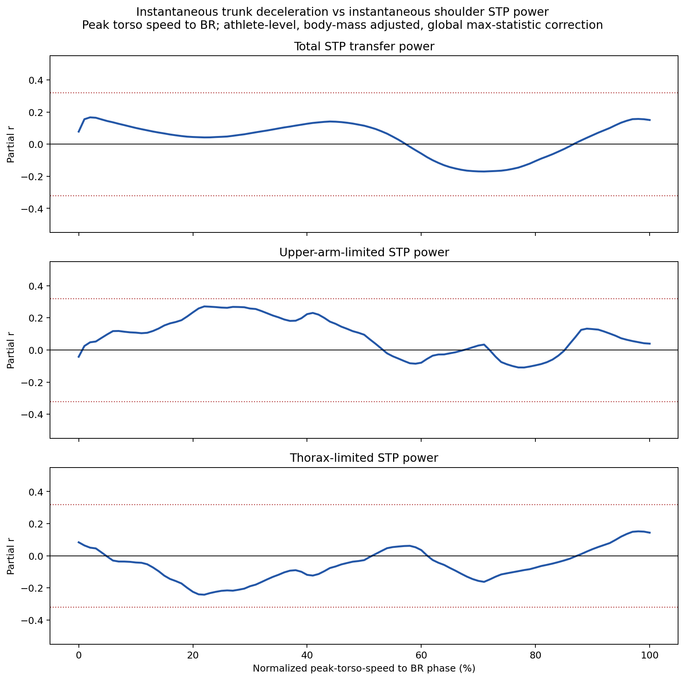

# 肩部 STP 分解驗證

## 結論

肩部 STP 的兩側限制端接近平均，但上臂側略常成為較小端。於 `fp_poi_time` 至 BR 的有效 STP transfer 時間點，上臂側較小占53.1%，軀幹側占46.9%；這不支持先前「上臂側占72.4%」的強瓶頸結論。

官方肩部總轉移的正確重建是 `fp_poi_time` 至BR的 `max(STP + JFP, 0)` 積分，不是有號淨功率積分。若研究「高功率且維持久」的主要傳能階段，應以FP至MER為主：正向總轉移平均在MER前已完成93.82%，MER後只剩6.18%；FP至BR保留作官方總量重建與敏感度比較。

這個46.9%不是「軀幹能量占STP的46.9%」。肩部STP transfer只計一次，兩側比例只是判定每個時間點由哪一側較小的力矩功率決定 `min(abs(thorax_stp), abs(upper_arm_stp))`。`thorax_stp = M_shoulder · omega_thorax` 是肩關節在軀幹側的力矩功率，不是軀幹節段的旋轉動能，也不是軀幹旋轉動能下降量。

## 正確公式

`thorax_dist_seg_pwr` 與 `upper_arm_prox_seg_pwr` 是總 segment power（SP），不是純 segment torque power（STP）：

```text
SP = JFP + STP
```

`shoulder_energy_transfer_jfp` 以流入上臂為正，因此：

```text
thorax_stp   = thorax_dist_seg_pwr + shoulder_energy_transfer_jfp
upper_arm_stp = upper_arm_prox_seg_pwr - shoulder_energy_transfer_jfp
```

### 軀幹側STP的三軸分量

直接以 `-shoulder_thorax_moment_axis * radians(torso_velo_axis)` 重建軀幹側肩部STP。三軸加總與上述 `thorax_stp` 高度對齊（r = 0.99486，MAE = 12.22 W），確認反作用力矩的負號與功率分解方向。

在 FP 至 BR：

- 以每個時間點絕對功率最大的軸判定：z軸88.96%、x軸10.55%、y軸0.49%
- 以三軸絕對功率總和加權：z軸83.54%、x軸13.49%、y軸2.98%

因此z軸不只是角速度最大，也是軀幹側肩部STP的主導功率分量。不能再把「減速代理只看z軸、漏掉其他軸」列為低相關的主要解釋。真正尚未直接驗證的是軀幹節段旋轉動能下降；目前算到的仍是肩關節軀幹側力矩功率，以及經 `min()` 後的肩部transfer。

但z軸占軀幹側肩部STP的83.5%，仍不代表「軀幹旋轉動能的83.5%成為STP」。前者分母是肩關節軀幹側三軸力矩功率絕對值；後者需要軀幹節段慣量張量與三維角速度計算 `K = 0.5 * omega' * I * omega`。目前full-signal CSV、metadata、動態C3D與model C3D均未直接輸出軀幹慣量，但專案其實包含原始建模檔 `baseball_pitching/code/v3d/model/v6_model_hybrid_lm.mdh`，可配合靜態model C3D在Visual3D重建個別慣量；先前「只有CMO輸出腳本、沒有建模檔」的判斷錯誤，已更正。

### 正向肩部總轉移：FP–MER主窗與FP–BR驗證

官方總肩部轉移實際對應：

```text
integral from fp_poi_time to BR of max(STP + JFP, 0)
```

先前以 `integral(STP + JFP)` 計算成淨能量，平均被負向功率扣除約18.69 J，導致錯誤的平均功率與組成模型；該結果已撤銷。改為正向總功率後，411球重建值與官方FP–BR總轉移r=0.9987、平均差（官方－重建）-0.30 J、MAE 0.35 J；投手層級r=0.9995、MAE 0.26 J。

411球與100位投手均完整保留。投手平均FP–MER時間0.1081 s，正向總轉移317.97 J，pooled mean positive power 2984 W；完整FP–BR時間0.1405 s、正向總轉移339.20 J。逐投手先算各球MER占比再平均，FP–MER占FP–BR正向總轉移平均93.82%。因此後續研究「哪些投手能同時維持較高功率與較長時間」以FP–MER為主，避免讓能量很少的MER後區間主導時間定義。

| FP–MER正向總轉移投手層級模型 | R² | adjusted R² | 重複10-fold CV R²（平均） |
|---|---:|---:|---:|
| 體重 | 0.506 | 0.501 | 0.352 |
| 體重＋FP–MER時間 | 0.545 | 0.536 | 0.346 |
| 體重＋FP–MER平均正向功率 | 0.619 | 0.611 | 0.488 |
| 體重＋時間＋平均正向功率 | 0.945 | 0.943 | 0.898 |

FP–MER時間與平均正向功率呈負相關（r=-0.483），但兩者各自都與FP–MER正向總轉移呈正相關（時間r=0.273；功率r=0.686）。100位投手中有21位同時高於兩者平均，只有2位同時位於兩者最高四分位，確認「高功率且維持久」是可辨識但嚴格門檻下少見的組合。完整模型標準化係數為平均正向功率β=1.045、FP–MER時間β=0.774，體重在兩個直接組成已知後只剩β=0.025（p=0.475）。這些係數不是機制貢獻率；能量本來就是正向功率對時間的積分，模型只用來確認「功率高、時間短」的群體權衡，以及哪些投手能同時位於兩者高端。

FP–BR敏感度分析以相同正向公式重算後，官方總轉移的體重R²仍為0.469；體重＋正向平均功率CV R²=0.660，加入FP–BR時間後為0.963。FP–BR結果保留用於官方總量核對，不作後續「維持主要傳能階段」的首選時間窗。

- 日期：2026-08-29
- 腳本：`baseball_pitching/code/py/analyze_total_shoulder_transfer_duration_power.py`
- 輸出：`baseball_pitching/code/py/total_shoulder_transfer_outputs/`

### 肩髖分離與軀幹轉速能否解釋「高功率且維持久」

不支持「肩髖分離大 × 軀幹轉速快」形成正向協同，使投手同時具有較高FP–MER正向平均功率與較長FP–MER時間。以100位投手為單位，將兩項結果各自標準化後取較小值 `min(z時間, z功率)` 作為聯合高分數；此定義要求兩項都高，且不使用總能量以避免循環論證。肩髖分離同時檢驗FP值與整段最大值，軀幹轉速使用 `max_torso_rotational_velo`。

FP肩髖分離主要對應時間：與FP–MER時間r=0.350，但與平均正向功率r=0.029；最大肩髖分離的對應較弱（時間r=0.188、功率r=0.097）。軀幹峰值轉速則與平均功率只有小正相關r=0.125，與時間幾乎無關r=-0.042。控制體重後的交互作用對聯合高分數均不顯著：FP分離版本β=-0.017、p=0.818；最大分離版本β=-0.039、p=0.619。

out-of-sample結果也不支持這個組合。聯合高分數的體重基準重複10-fold CV R²=0.093；加入FP分離與軀幹轉速後為0.097，再加交互作用反降至0.079。最大分離版本分別為0.093、0.096、0.086。100位投手中，21位同時高於時間與功率平均；他們比其餘79位重14.22 kg、FP分離大3.18°，但軀幹峰值轉速只快7.2 deg/s，不能把這群人的共同特徵描述成「分離大且軀幹轉速快」。

411球 mixed-effects 敏感度將投手間與投手內訊號拆開後方向一致：FP分離較大主要伴隨較長時間；軀幹轉速較快主要伴隨較高功率。同一投手某球的軀幹轉速比自己平均更快時，功率較高但FP–MER時間反而較短；FP分離比自己平均更大時，時間較長但功率較低。較合理的整理是兩個變項分別承載時間與功率訊號，而非已找到突破兩者負相關權衡的共同機制。以上p值與模型屬探索性、未作多重比較確認。

- 日期：2026-08-29
- 腳本：`baseball_pitching/code/py/analyze_separation_torso_joint_power_duration.py`
- 輸出：`baseball_pitching/code/py/separation_torso_joint_power_duration_outputs/`

### 原始模型如何計算軀幹慣量

OpenBiomechanics的CMZ建立流程先套用 `v6_model_hybrid_lm.mdh`，再執行Filter、Events與 `CMO.v3s`。MDH將軀幹命名為Visual3D預設節段 `RTA`（Thorax/Ab），而 `MASS`、`GEOMETRY`、`IXX`、`IYY`、`IZZ` 均未自訂，因此沿用Visual3D的Dempster節段質量與Hanavan幾何慣量預設值。

原始模型對每位投手使用：

```text
m_RTA = 0.355 * body_mass
d = 0.5 * distance(C7, CLAV)
r = 0.5 * distance(RSHO, LSHO)
L = distance(midpoint(CLAV, C7), midpoint(STRN, T10))
```

其中 `d` 是橢圓柱的前後深度半徑，`r` 是肩寬方向半徑，`L` 是軀幹節段長度。Visual3D的橢圓柱公式為：

```text
Ixx = m_RTA * (3*d^2 + L^2) / 12
Iyy = m_RTA * (3*r^2 + L^2) / 12
Izz = m_RTA * (d^2 + r^2) / 4
```

因此原始逆動力學中的 `I` 不是只由體重決定，也不是直接使用 `mass * height^2`；它同時包含體重與每位投手靜態校正得到的軀幹長度、肩寬和前後深度。現有 `mass * delta_omega_sq` 與 `mass * height^2 * delta_omega_sq` 只能視為粗略尺度代理。若要直接重算軀幹動能下降，應由原始Visual3D模型匯出每位投手的RTA慣量，並讓角速度與慣量張量使用同一節段座標系。

### 100位投手的慣量重建與近似誤差

2026-08-11依照上述MDH定義，從100個session各自的靜態model C3D重建RTA慣量。所有100個模型均有必要標記；其中session 1759的標記帶有已確認的 `Skeleton_001_` 命名空間，明確移除此前綴後使用，沒有排除投手。model C3D為11幀、座標單位為公尺，六個軀幹標記以有效幀平均位置代表靜態位置；全部模型中單一標記相對平均位置的最大偏移為1.87 mm。以每個靜態幀各自算出的 `Izz` 比較平均位置重建值，每位投手的最大幀偏差中位數為0.031%，全資料最大為0.386%；「先平均座標再算」與「逐幀算完再平均」的最大差異只有0.0010%。這表示靜態幀選擇造成的數值誤差很小，但因資料沒有Visual3D直接匯出的個別慣量，仍不能把它稱為相對原軟體輸出的真實誤差。

重建結果：

```text
Izz平均 = 0.2241 kg*m^2
Izz SD   = 0.0477 kg*m^2
Izz範圍 = 0.1324–0.3606 kg*m^2

平均軀幹長度 L = 0.2593 m
平均前後深度半徑 d = 0.0824 m
平均肩寬半徑 r = 0.1438 m
```

`Izz`的幾何項為 `d^2 + r^2`；其中肩寬半徑平方平均占75.1%。身高與 `d`、`r` 的相關只有r = 0.092與0.165，因此身高不是這批投手橫向軀幹尺寸的良好替代量。

若靜態標記真的不存在，可將

```text
Izz = m_RTA * kz^2
m_RTA = 0.355 * body_mass
```

中的迴轉半徑固定為本樣本估計的 `kz = 0.08372 m`，得到：

```text
Izz ≈ 0.0024884 * body_mass_kg
```

留一投手交叉驗證顯示，固定迴轉半徑近似的prediction R² = 0.612、中位絕對百分比誤差9.1%、第95百分位誤差23.1%。相較之下，最佳尺度係數的身高模型：

```text
Izz ≈ 0.00071497 * body_mass_kg * height_m^2
```

其留一投手prediction R² = 0.545、中位誤差9.7%、第95百分位誤差25.7%。因此本資料的優先順序是：個人靜態標記重建 > 固定迴轉半徑乘節段質量 > `mass * height^2`。後兩者只適用於缺少model C3D的敏感度分析，不能替代主分析。

若允許由這100位投手經驗性估計次方，使用對數線性allometric模型，並在每一次留一投手交叉驗證中重新估計係數與次方：

| 模型 | 全樣本估計式 | LOOCV prediction R² | 中位APE | 第95百分位APE |
|---|---|---:|---:|---:|
| 固定迴轉半徑 | `0.0024884 * M` | 0.612 | 9.1% | 23.1% |
| 固定質量一次方、調身高次方 | `0.0017193 * M * H^0.563` | 0.609 | 8.2% | 23.1% |
| 只調體重次方 | `0.00017913 * M^1.579` | 0.715 | 7.7% | 21.1% |
| 同時調體重與身高次方 | `0.00017666 * M^1.608 * H^-0.183` | 0.715 | 7.6% | 21.1% |

10,000次投手bootstrap中，`M * H^b` 的 `b` 95%區間為0.059–1.105，不支持固定為2；雙次方模型的身高次方為-0.183，95%區間-0.711–0.323，包含0。加入身高並未改善只用 `M^a` 的交叉驗證表現。最佳簡單經驗近似因此是：

```text
Izz ≈ 0.00017913 * body_mass_kg^1.579
```

但這條式子的係數帶有補償次方所需的單位，而且體重次方大於1可能是在同一批投手中同時代理體重與胸廓橫向尺寸；它是本資料族群的預測公式，不是可跨族群宣稱的慣量定律。若要求物理可解釋性，仍應使用個人標記公式，或在標記缺失時使用固定 `kz` 模型。

由於 `CMO.v3s` 將 `TORSO_ANGULAR_VELOCITY` 解析在RTA座標系，z軸旋轉動能下降可以直接用同座標系的 `Izz`，但角速度必須先由deg/s轉成rad/s：

```text
omega_rad_s = omega_deg_s * pi / 180
delta_Kz_J = 0.5 * Izz * (omega_peak_rad_s^2 - omega_BR_rad_s^2)
```

### 個人化慣量是否解決減速與STP的低相關

將100位投手重建的個人 `Izz` 實際乘入每球峰值軀幹轉速至BR的 `delta_omega_sq`，再在投手內平均。重建的z軸旋轉動能下降平均34.91 J、中位33.91 J、範圍16.92–62.73 J。結果如下：

| 肩部能量指標 | 積分窗 | raw r | 控制體重partial r | p |
|---|---|---:|---:|---:|
| STP | FP–BR | 0.389 | 0.107 | 0.288 |
| 總肩部轉移 | FP–BR | 0.537 | 0.263 | 0.008 |
| STP | 各球軀幹峰值轉速–BR | 0.299 | -0.026 | 0.796 |
| STP+JFP | 各球軀幹峰值轉速–BR | 0.281 | 0.030 | 0.770 |

在FP–BR模型中，體重本身解釋STP的32.8%；加入個人化 `delta_Kz` 後只額外增加0.8%（p = 0.291）。對總肩部轉移則額外增加3.7%（p = 0.009）。因此個人化慣量會提高未校正相關，但主要來自共同體型；它沒有解決STP在體重之外的低相關。把能量窗嚴格對齊至峰值轉速–BR後，partial r更接近零，也排除FP–BR積分窗不一致是主要原因。

這項結果解答的是計算疑點：低相關不是因為漏乘 `Izz`、用錯身高體重次方，或能量窗沒有對齊。但它尚未完成軀幹能量去向的逐項守恆。原因是 `delta_Kz` 是整個RTA節段單一旋轉模態的狀態改變，而肩部STP只是投球肩關節力矩功率中的可轉移共同部分，還會由兩側功率絕對值較小者限制。即使只看z軸，也只有在「投球肩力矩是RTA z軸淨力矩的唯一來源、沒有三維旋轉耦合、且上臂側不形成瓶頸」時，兩者才可能一一對應；本資料顯然不符合這些條件。

### 只看軀幹側限制時期

為直接檢驗瓶頸假說，逐幀限定為：軀幹側與上臂側STP異號、軀幹側絕對功率較小，且方向為軀幹流向上臂。只有區間兩端連續兩幀都符合條件時，才同時累積個人化z軸動能變化與官方STP，避免將限制端切換的跨界區間混入。

| 分析窗 | 平均限制期時間 | 同窗STP | 同窗正向Kz損失 | 控制體重r | 再控制時間r | 平均功率partial r |
|---|---:|---:|---:|---:|---:|---:|
| FP–BR | 0.0575 s | 67.68 J | 15.47 J | 0.638 | 0.518 | 0.297（p=0.003） |
| 軀幹峰值轉速–BR | 0.0369 s | 46.75 J | 15.47 J | 0.754 | 0.316 | 0.079（p=0.438） |

峰值轉速–BR中，100位投手均保留在累積能量分析；其中98位有非零的連續軀幹限制區間，可計算平均功率。該窗幾乎只有Kz下降，平均淨損失15.464 J、正向損失15.465 J、重新增加僅0.001 J。這15.47 J約為完整峰值–BR Kz損失34.91 J的44.3%。

強能量相關主要由限制期持續時間驅動：控制體重後，持續時間與STP為r=0.905，與Kz損失為r=0.732；能量對能量的r=0.754在再控制時間後降至0.316。改比較每秒平均功率後，控制體重只剩r=0.079且不顯著。因此更精確的結論是：在軀幹側實際決定STP的峰值後區間，累積Kz損失確實與累積STP高度同步，但主要因為投手維持這個限制／轉移狀態多久，而不是瞬時Kz損失功率越高者具有更高STP功率。

同窗STP平均46.75 J，高於Kz損失15.47 J，不能把STP全部解讀為z軸動能直接釋放；它仍需要完整RTA三維旋轉、平移與各邊界功率平衡才能守恆。

### STP 能量中的持續時間與平均功率

進一步直接分解 FP–BR 軀幹側限制期的肩部 STP：每球只納入連續兩幀皆為兩側 STP 異號、軀幹側絕對功率較小、且方向為軀幹流向上臂的區間。以每位投手的平均每球能量為結果，並用 `總能量 / 總有效時間` 定義 pooled mean power，因此每位投手均精確符合 `平均每球能量 = 平均每球有效時間 × pooled mean power`。100位投手皆有正有效時間；平均能量67.68 J、平均有效時間0.05754 s、平均 pooled power 1129 W。

| 投手層級模型 | R² | adjusted R² | 重複10-fold CV R²（平均） |
|---|---:|---:|---:|
| 體重 | 0.165 | 0.156 | -0.032 |
| 體重＋有效時間 | 0.807 | 0.803 | 0.729 |
| 體重＋pooled mean power | 0.483 | 0.473 | 0.264 |
| 體重＋有效時間＋pooled mean power | 0.950 | 0.948 | 0.924 |

完整線性模型的標準化係數為有效時間 β=0.734、pooled mean power β=0.419、體重 β=0.051；三者p值分別為 `<0.001`、`<0.001`、0.044。411球 mixed-effects 敏感度模型將時間與功率各拆成投手間平均及投手內偏差後，兩者的投手間與投手內係數皆為正且p值皆`<0.001`，表示結果不只來自不同體型投手間的差異。

結論為：累積 STP 的主要可預測成分是有效轉移狀態維持多久，平均功率仍提供重要而較小的額外訊號；體重在兩者已知後只剩很小的獨立係數。這不是「時間造成能量」的因果證據，因為能量本來就是功率對時間的積分；這項分解的用途是確認投手間差異較多來自 duration，而不是只來自更高的平均 transfer power。線性三變項模型未加 `duration × power` 交互作用，所以不會像精確乘法恆等式得到R²=1；其CV結果描述的是在新投手上的線性預測表現。

- 日期：2026-08-29
- 腳本：`baseball_pitching/code/py/analyze_stp_duration_power_prediction.py`
- 輸出：`baseball_pitching/code/py/stp_duration_power_outputs/`

### 肩外轉速度與肩部能量轉移

肩關節z軸角速度的專案定義為內轉正、外轉負；因此最大肩外轉速度定義為FP至MER間 `-min(shoulder_velo_z)`。以100位投手為獨立分析單位，平均最大肩外轉速度為1419 deg/s（SD 188，範圍1027–1903）。

| 能量結果 | 未校正r | 控制體重partial r | p | 四個主要終點Bonferroni p |
|---|---:|---:|---:|---:|
| FP–MER STP | -0.024 | 0.062 | 0.539 | 1.000 |
| FP–MER STP+JFP | 0.041 | 0.201 | 0.045 | 0.180 |
| FP–BR STP | -0.033 | 0.059 | 0.563 | 1.000 |
| FP–BR官方總肩部轉移 | 0.062 | 0.219 | 0.029 | 0.115 |

所以目前不支持「肩外轉越快，肩部STP越多」。總肩部轉移在控制體重後只有小正向訊號，而且多重比較校正後不成立。分解顯示訊號偏向JFP：FP–MER JFP partial r = 0.232（p = 0.020），FP–BR JFP partial r = 0.185（p = 0.066）；這些是診斷性分析，不另視為校正後成立的主要結果。

411球層級、以投手為cluster的敏感度模型方向一致：每增加100 deg/s外轉速度，控制體重後FP–MER總轉移增加4.47 J（95% CI 0.51–8.44，p = 0.027），FP–BR官方總轉移增加5.35 J（95% CI 0.93–9.77，p = 0.018）；STP仍無關。由於外轉速度與能量為同一動作過程中的同期結果，且主要訊號來自JFP，不能將其解讀為外轉速度造成能量轉移。

若暫以體重近似 `I_T`，使用 `mass * (omega_peak^2 - omega_BR^2)`，與重建STP的原始相關升至r = 0.376（R² = 0.142）；以 `mass * height^2`作慣量尺度時為r = 0.447（R² = 0.200）。但目標能量本身與體重高度相關，因此主要是共享體型訊號：體重基準模型已解釋STP的32.8%，加入質量加權下降代理後只額外增加3.5%（p = 0.023）；以體重與身高為基準，`mass * height^2`版本也只額外增加3.6%（p = 0.022）。對總肩部轉移，兩種代理的額外R²分別為4.0%與4.4%。所以「直接乘體重」會提高表面相關，但在體型之外仍只有小幅獨立解釋力；它仍不是個別軀幹慣量的實測值。

當兩側 STP 異號時：

```text
transfer magnitude = min(abs(thorax_stp), abs(upper_arm_stp))
```

軀幹側為負、上臂側為正時，transfer 記為正；方向相反時記為負；同號時 torque transfer 為零。

此公式與 full-signal `shoulder_energy_transfer_stp` 的逐幀結果完全對齊：

- 全部有效列：411球
- r = 1.000000000000
- 平均絕對誤差：0.000017 W
- 最大絕對誤差：0.0008 W
- `thorax_stp + upper_arm_stp = shoulder_energy_generated`，平均絕對誤差0.000028 W

## FP 至 BR 結果

- 事件窗：`fp_poi_time` 至 `BR_time`
- 全部時間點：21,205
- 兩側 STP 異號、存在 torque transfer：20,166（95.1%）
- frame-weighted：上臂側較小53.1%，軀幹側較小46.9%
- 各球比例取平均：上臂側53.2%，軀幹側46.8%
- 411球中：226球以上臂側較小時間點居多，174球以軀幹側居多，11球相同
- 依 transfer magnitude 加權：上臂側較小54.6%，軀幹側較小45.4%
- transfer方向：99.3%的有效時間點為軀幹流向上臂

### 瓶頸當下的功率大小

瓶頸時間比例與功率大小分開計算：

| 當下限制端 | 時間點占比 | 條件平均 transfer power | 條件中位 transfer power | 累積功率樣本占比 |
|---|---:|---:|---:|---:|
| 軀幹側 | 46.9% | 1147 W | 1103 W | 45.4% |
| 上臂側 | 53.1% | 1223 W | 1218 W | 54.6% |

上臂限制時的條件平均功率比軀幹限制時高6.6%。以每位投手先平均後配對，上臂限制時為1269 W、軀幹限制時為1104 W（paired p < 0.001）。因此時間占比沒有掩蓋「軀幹限制時功率特別大」；資料反而顯示上臂限制端在時間和功率強度上都略占較多。

將同一位投手的軀幹旋轉動能下降代理 `omega_peak^2 - omega_BR^2` 與兩部分拆開比較，控制體重後：

| STP部分 | partial r | p |
|---|---:|---:|
| 軀幹限制時的條件平均功率 | -0.080 | 0.431 |
| 上臂限制時的條件平均功率 | 0.248 | 0.013 |
| 軀幹限制時間點的累積功率樣本 | -0.195 | 0.052 |
| 上臂限制時間點的累積功率樣本 | 0.475 | <0.001 |
| 兩部分合計 | 0.232 | 0.020 |
| 上臂側較小的時間比例 | 0.269 | 0.007 |

這表示減速代理的正向訊號主要出現在「上臂側較小、由上臂端決定實際transfer」的時間，而不是軀幹側成為較小端的時間；減速越大者也更常以上臂側為較小端。兩部分加總時方向相反，會削弱總STP與減速代理的整體相關。`累積功率樣本`是 transfer power 乘上近乎固定取樣間隔前的等比例量；資料時間因四位小數儲存而在0.0027與0.0028秒間交替，因此此處用於分解占比與相關，不冒充精確事件積分焦耳。

上述百分比的分母不同，不能相乘或直接推導解釋率：z軸83.5%是「軀幹側肩部STP內部」的軸向組成；軀幹限制部分45.4%是「實際transfer累積功率樣本」的組成；約5%則是100位投手之間，控制體重後 `delta_omega_sq` 與總STP的共享變異。高組成占比不保證投手間共變異高。

控制體重後進一步將 `delta_omega_sq` 與總累積功率樣本的共變異拆開：上臂限制部分提供總正向共變異的204.9%，軀幹限制部分貢獻-104.9%，兩者相加才是100%。超過100%不是能量占比，而是因一部分正向、一部分負向；它直接顯示軀幹限制部分抵銷了約一半的上臂限制正向訊號。

### 限制端的時間順序

限制端不是完全雜亂，而有明顯的群體相位結構。FP至BR前60%主要為上臂側較小，之後逐漸轉向軀幹側較小；70–80%時軀幹側占61.8%，80–90%占87.8%，90–100%占93.5%。BR最後一個有效時間點有92.7%的球為軀幹側較小。

逐球原始訊號仍常有早期交錯：切換次數中位數2次（IQR 2–3），76.2%的球至少切換兩次。最常見序列為 `軀幹→上臂→軀幹`（31.4%）、`上臂→軀幹→上臂→軀幹`（27.7%）及`上臂→軀幹`（21.7%）。所以較準確的描述是「早中期可交錯，但末段高度一致地收斂到軀幹側限制」，不是單一固定切換，也不是隨機散布。

功率累積確認時間占比會高估末段軀幹限制的重要性。FP至BR前30%只累積22.9%的transfer power；50–80%單獨貢獻44.6%；至MER已累積88.5%，MER後只剩11.5%。MER前的累積功率中60.3%由上臂側限制，MER後則88.9%由軀幹側限制。換成全部transfer power的四分法，最大單一區塊是「MER前＋上臂限制」53.4%，其次為「MER前＋軀幹限制」35.2%，「MER後＋軀幹限制」10.2%，「MER後＋上臂限制」1.3%。因此能量大宗確實落在MER前的上臂限制區間；末段雖幾乎都由軀幹限制，但剩餘可轉移功率已少。

#### 最後一次持續上臂→軀幹限制交接

為避免早期短暫來回切換干擾，主要交接事件定義為：最後一次進入軀幹限制，之後所有有效STP時間點直到BR都不再回到上臂限制。411球中372球（90.5%；涵蓋96位投手）可定義此事件。交接中位位於FP–BR 72.3%（IQR 63.3–78.6%），相對MER為提前8.3 ms（IQR提前16.7 ms至延後0.7 ms）；75.0%的球在MER前完成交接。交接後仍剩餘的正向STP能量中位為23.3%（IQR 11.4–35.4%）。

控制體重後，投手平均交接早晚與FP–BR正向STP能量（partial r=-0.122，p=0.237）、FP–MER正向STP能量（r=-0.110，p=0.285）、有效STP持續時間（r=0.097，p=0.348）皆無明確關係；較早交接與較高有效期平均功率只有弱方向訊號（r=-0.184，p=0.073）。因此目前可把「約MER前8 ms完成由上臂限制轉為軀幹限制」當作群體時序描述，不能把它定成越早或越晚越好的教練門檻。下一步應比較交接前後的上臂絕對角速度、肩力矩及肩部姿勢，找出造成交接的可操作動作，而不是直接訓練交接百分比。

### 總下降量與STP功率的SPM時序

以100位投手為獨立分析單位，每球FP至BR正規化101點後先在投手內平均。預測量為投手平均 `omega_peak^2 - omega_BR^2`，結果曲線為正向STP transfer power，SPM GLM同時控制體重。總STP沒有顯著cluster；拆開限制端後，只有上臂限制功率在FP–BR 52.74–63.87%出現顯著正相關cluster（cluster p = 0.000047，區間平均partial r = 0.354，峰值partial r = 0.378，位於57%）。即使對總STP、上臂限制、軀幹限制三個SPM檢定作Bonferroni校正，該cluster仍成立（adjusted p約0.00014）。軀幹限制功率沒有顯著cluster。

此分析將「能量增加」操作化為瞬時正向STP功率，而預測量仍是每位投手峰值至BR的整段總下降量。顯著區間早於MER中位77.18%（IQR 74.66–78.83%），也正位於上臂限制比例及整體transfer power都較高的中段。它只能解讀為：最終總下降量較大的投手，在FP–BR約53–64%的上臂限制階段具有更高STP功率；不能解讀為該時間點的瞬時減速與功率同步增加。


### 瞬時減速與瞬時STP功率

為直接回答同步關係，另計算每一時間點的有號減速 `-d(abs(torso_velo_z))/dt`（正值為減速、負值為加速）與同一時間點STP功率的投手間partial r，控制體重。以10,000次投手配對置換的全域max-statistic，同時校正101個時間點與總STP、上臂限制、軀幹限制三條曲線。

軀幹峰值轉速位於FP–BR中位39.45%（IQR 34.78–45.69%）。在每球各自的峰值轉速至BR重新正規化後：

| 功率曲線 | 最大絕對partial r | 位置 | 全域校正 |
|---|---:|---:|---|
| 總STP | -0.170 | peak-to-BR 71% | 無顯著區間 |
| 上臂限制STP | 0.271 | peak-to-BR 22% | 無顯著區間 |
| 軀幹限制STP | -0.242 | peak-to-BR 22% | 無顯著區間 |

因此沒有證據顯示真正減速期內「瞬時減速較大」會在同一時間點伴隨更高STP功率。FP–BR未以峰值對齊的分析只在0–2%的總STP與1–10%的軀幹限制功率出現顯著正相關，但這些區間早於典型峰值轉速，且包含FP邊界導數，不應當作峰值後減速傳能的證據。較合理的整理是：整段總下降量帶有投手層級的動作／容量訊號，但瞬時減速與肩部STP並未呈現直接同步耦合。



## 限制端分組與球速

以每位投手各球的限制端比例先取平均，再依上臂側較小比例是否高於50%分組：

| 組別 | n | 平均球速 | 平均體重 |
|---|---:|---:|---:|
| 軀幹側較小時間居多 | 41 | 85.82 mph | 93.26 kg |
| 上臂側較小時間居多 | 59 | 84.00 mph | 88.98 kg |

未校正差異為上臂組慢1.82 mph，Welch p = 0.0506；未達預先常用的0.05門檻。由於軀幹組平均重4.28 kg，控制體重後，上臂組慢1.35 mph（p = 0.161，95% CI -3.24至0.55 mph），沒有顯著組別差異。

不切組而使用連續的「上臂側較小時間比例」時，與球速的未校正相關為 r = -0.244（p = 0.014）；控制體重後為 partial r = -0.189（p = 0.059）。因此目前只有「上臂側較常限制者可能稍慢」的方向性訊號，尚未獲得體重校正後的穩健支持。

411球層級、以投手為cluster的敏感度模型同樣未達顯著：控制體重後，上臂限制球慢1.11 mph（p = 0.185，95% CI -2.75至0.53 mph）。主結論仍以100位投手分析為準。

## 錯誤來源

舊算法直接計算：

```text
min(abs(thorax_dist_seg_pwr), abs(upper_arm_prox_seg_pwr))
```

這是對兩側總SP取最小值，混入JFP，不是肩關節兩側STP的分解。舊版72.4%另使用不受信任的 `fp_100_time`；後續以 `fp_poi_time` 重算得到的59.6%仍沿用錯誤SP公式。兩者均不應保留為正式結論。

## FP至MER正向總轉移的STP/JFP守恆分解

正向總能量不能拆成 `max(STP,0)+max(JFP,0)`，因為這會重複計入彼此抵銷的功率。本分析只在每幀 `STP+JFP>0` 時保留兩個有號分量，再分別積分；411球的 `STP分量+JFP分量=正向總轉移` 最大誤差僅 `1.7e-13 J`。

以100位投手先在個人內平均，FP至MER正向總轉移平均317.97 J，其中STP分量139.27 J（43.8%），JFP分量178.70 J（56.2%）。正向總轉移期間，STP幾乎不出現負向抵銷（平均-0.001 J），JFP平均抵銷-0.92 J。因此目前應將FP至MER總量理解為「JFP略多於STP」，而非單由某一分量主導。

控制體重後，將肩髖分離與軀幹峰值轉速加入固定模型：

| 結果 | 體重CV R² | 體重＋FP肩髖分離＋軀幹轉速CV R² | FP肩髖分離標準化beta（p） | 軀幹轉速標準化beta（p） |
|---|---:|---:|---:|---:|
| STP分量 | 0.093 | 0.174 | 0.278（0.001） | 0.130（0.124） |
| JFP分量 | 0.244 | 0.305 | 0.193（0.010） | 0.148（0.053） |

這表示原假說需要拆開修正：FP肩髖分離較大與兩個分量都呈獨立正向關係，且對STP較強；軀幹峰值轉速對STP沒有獨立顯著關係，對JFP只有邊界訊號。換用最大肩髖分離時，分離本身對STP與JFP皆未達顯著，顯示訊號較偏向「FP當下已建立的分離」，不是單純追求更大的最大值。模型的投手外CV解釋仍有限，尚不能說已找到「同時高功率且維持久」的完整原因。

### STP＋JFP的具體公式與CSV對齊

令肩關節作用於上臂的力與力矩為 `F`、`M`，肩關節中心速度為 `v_s`，上臂與軀幹的絕對角速度為 `omega_A`、`omega_T`。Visual3D原始定義為：

```text
JFP = dot(F, v_s)
P_arm_STP = dot(M, omega_A)
P_thorax_STP = dot(-M, omega_T)
```

STP transfer不是直接將兩側相加，而是只有兩側torque power異號時，取可從一側流入另一側的共同部分：

```text
if P_thorax_STP < 0 and P_arm_STP > 0:
    STP = +min(abs(P_thorax_STP), abs(P_arm_STP))
elif P_thorax_STP > 0 and P_arm_STP < 0:
    STP = -min(abs(P_thorax_STP), abs(P_arm_STP))
else:
    STP = 0
```

因此瞬時肩部總轉移功率與FP至MER正向總能量分別是：

```text
P_shoulder_transfer = STP + JFP
E_positive_FP_MER = integral_FP^MER max(P_shoulder_transfer, 0) dt
```

現有CSV沒有直接匯出Visual3D `ProxEndVel`，所以 `force * d(shoulder_jc)/dt` 不能精確重建JFP；最合理符號版本仍只有r=0.520、MAE 782.6 W。另以肩、肘關節中心中點近似上臂中心，再微分並與同一肩力點乘，結果更差（r=0.457、MAE 1639.6 W）；因此資料不支持把 `ProxEndVel` 改解釋為上臂中心速度。可改用同一肩關節在軀幹側的segment-power守恆，而且不需要猜測速度座標系：

兩組肩力的向量大小幾乎一致（thorax與upper-arm表示的norm r=0.9974、MAE 5.20 N），但同名xyz分量相關很低，確認它們主要是同一物理力在不同局部座標基底下的表示。以 `thorax_prox`、`thorax_dist`、`thorax_ap` 重建逐幀軀幹正交基底後，最佳右手軸映射為局部 `x→前後軸、y→反向左右軸、z→軀幹長軸`；旋轉至LAB再與肩中心速度點乘，JFP提升至r=0.9353、MAE 268.4 W。Savitzky–Golay 5至21幀微分只將最佳結果微幅改善至r=0.9354、MAE 267.6 W，故剩餘差異不能只歸因於速度平滑窗；較可能來自landmark重建的segment姿態不等同Visual3D內部6-DOF `RTA_ROTMAT`，或CSV未保留官方 `ProxEndVel` 的完整精度。此旋轉重建可支持座標系診斷，但仍不應取代官方JFP。

```text
P_thorax_STP_csv = -sum_axis(
    shoulder_thorax_moment_axis * radians(torso_velo_axis)
)
JFP_csv = P_thorax_STP_csv - thorax_dist_seg_pwr
P_arm_STP_csv = upper_arm_prox_seg_pwr - JFP_csv
STP_csv = bottleneck(P_thorax_STP_csv, P_arm_STP_csv)
P_shoulder_transfer_csv = STP_csv + JFP_csv
```

411球FP至MER共16,425幀的驗證結果：`JFP_csv`對官方JFP為r=0.9975、MAE 42.72 W；`STP_csv`對官方STP為r=0.9942、MAE 42.55 W；兩者誤差在總功率中幾乎互相抵銷，`STP_csv+JFP_csv`對官方 `STP+JFP` 為r=0.999994、MAE 0.167 W。若目的只是重建總肩部轉移，這套CSV公式已對齊；若要把JFP再拆成力大小、肩中心速度與夾角，仍需另行匯出與Visual3D相同的 `RAR::ProxEndForce` 和 `RAR::ProxEndVel` 向量，現有有限差分速度不可取代。

## 重現

- 日期：2026-07-29
- FP至MER守恆分解日期：2026-08-29
- STP/JFP公式對齊日期：2026-08-30
- 腳本：`baseball_pitching/code/py/validate_shoulder_stp_decomposition.py`
- 慣量重建腳本：`baseball_pitching/code/py/calculate_thorax_inertia.py`
- 軀幹限制期同窗分析：`baseball_pitching/code/py/analyze_thorax_limited_trunk_energy.py`
- 肩外轉速度分析：`baseball_pitching/code/py/analyze_shoulder_external_rotation_velocity_transfer.py`
- FP至MER STP/JFP守恆分解：`baseball_pitching/code/py/analyze_stp_jfp_positive_transfer_components.py`
- STP/JFP公式對齊：`baseball_pitching/code/py/align_shoulder_power_formula.py`
- 最後持續限制端交接：`baseball_pitching/code/py/analyze_stp_final_bottleneck_transition.py`
- 慣量與逐人LOOCV誤差：`baseball_pitching/data/poi/thorax_inertia_estimates.csv`
- 資料：`baseball_pitching/data/full_sig/energy_flow.csv`
- 公式來源：官方 `baseball_pitching/code/v3d/CMO.v3s` 中，segment power 定義為 JFP 與 STP 相加。
- 慣量模型：`baseball_pitching/code/v3d/model/v6_model_hybrid_lm.mdh`
- Visual3D文件：[Build CMZs](https://wiki.has-motion.com/doku.php?id=other%3Ainspect3d%3Atutorials%3Abuild_cmzs)、[Segment Mass](https://wiki.has-motion.com/doku.php?id=visual3d%3Adocumentation%3Amodeling%3Asegments%3Asegment_mass)、[Segment Inertia](https://wiki.has-motion.com/doku.php?id=visual3d%3Adocumentation%3Amodeling%3Asegments%3Asegment_inertia)、[Segment Properties Examples](https://www.wiki.has-motion.com/doku.php?id=visual3d%3Adocumentation%3Amodeling%3Asegments%3Asegment_properties_example)
